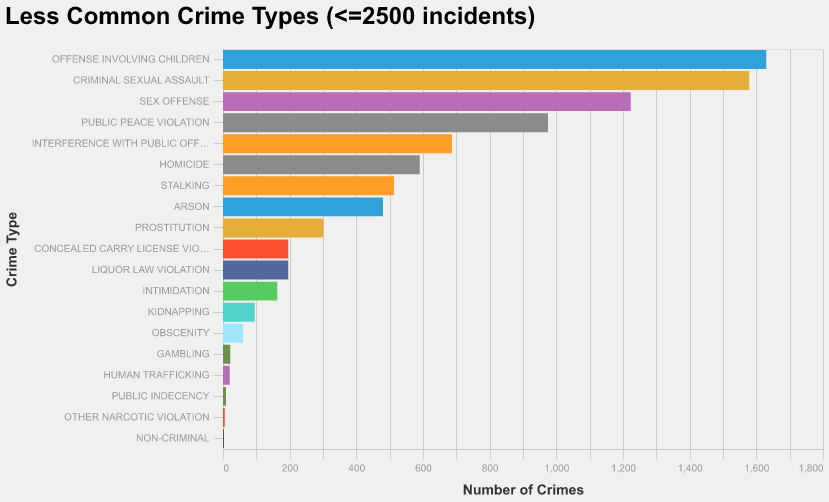
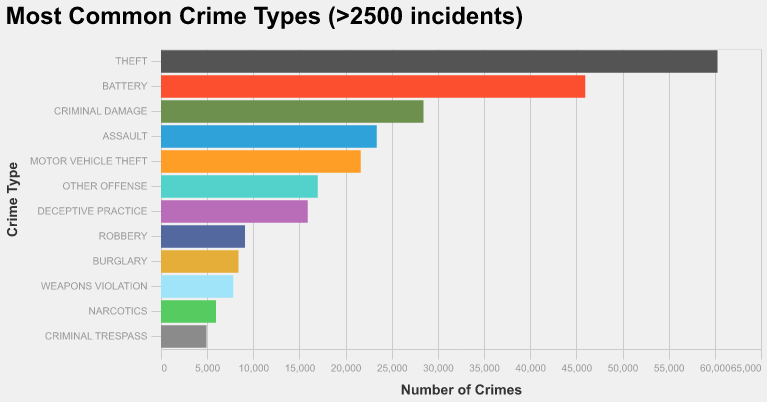
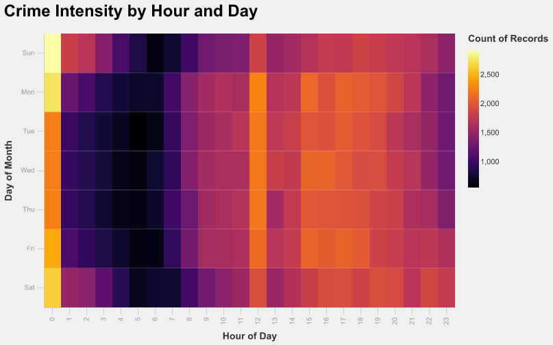
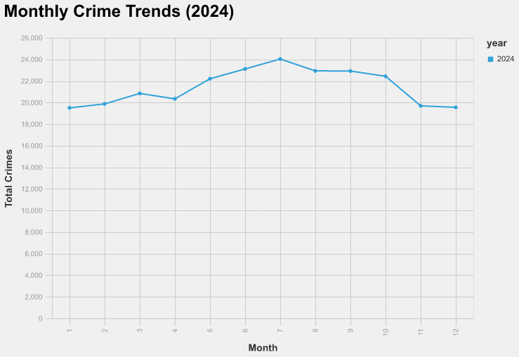
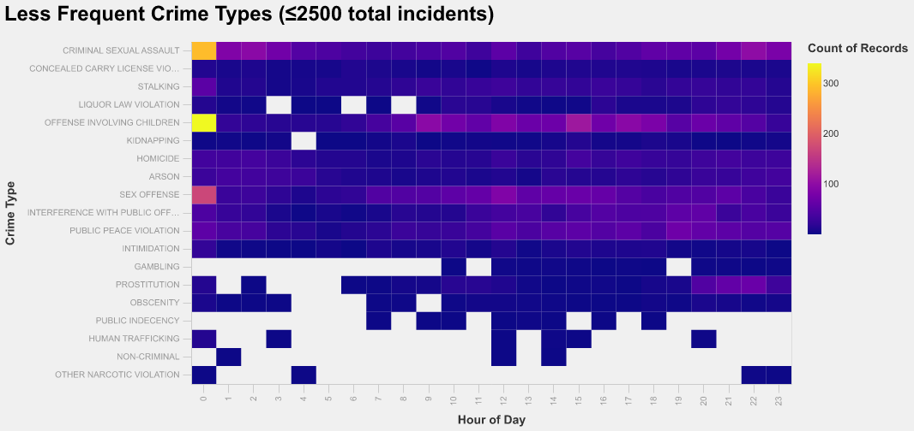
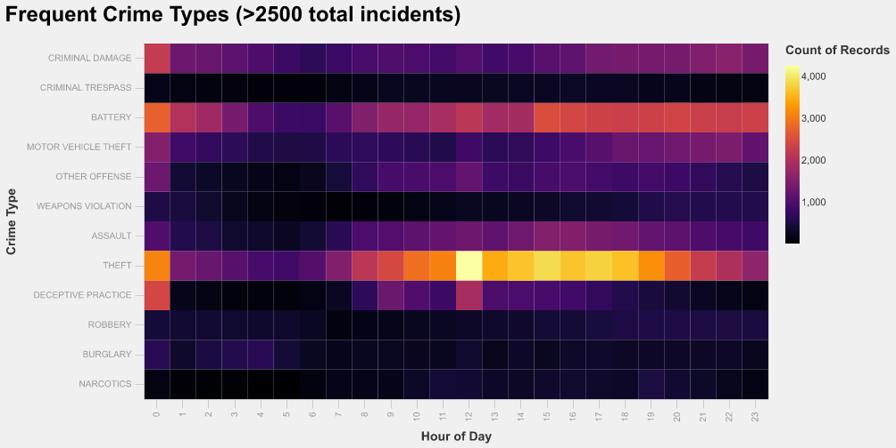
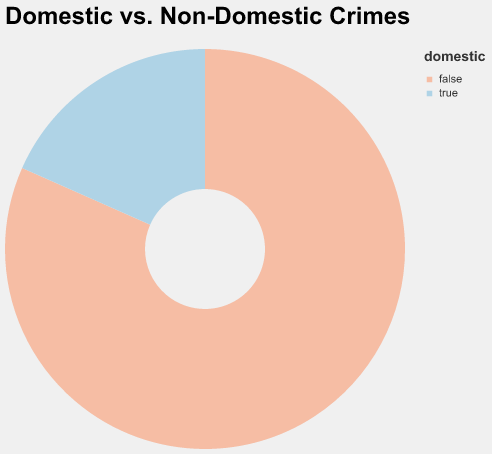
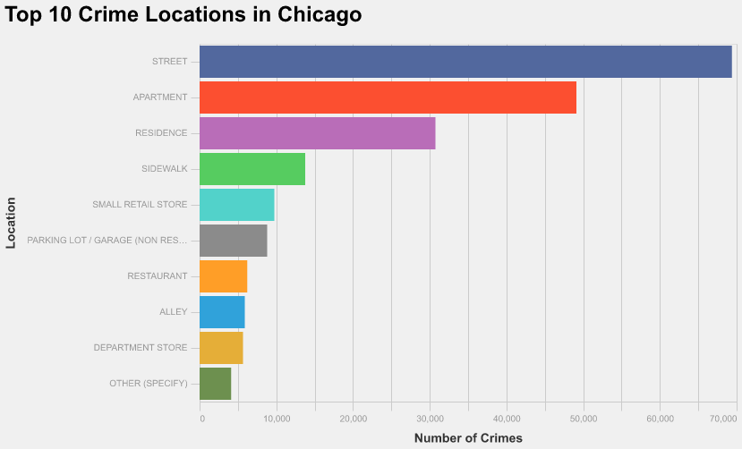
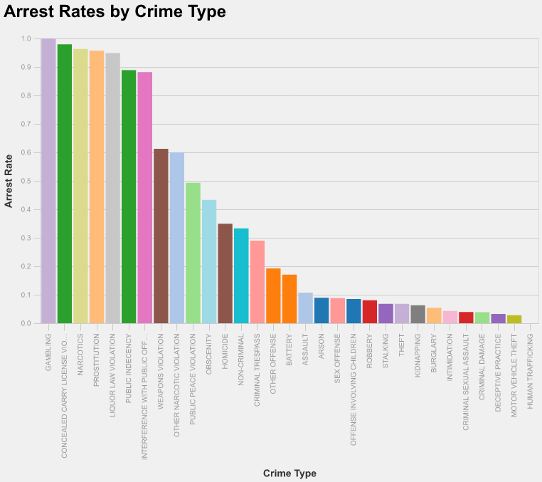
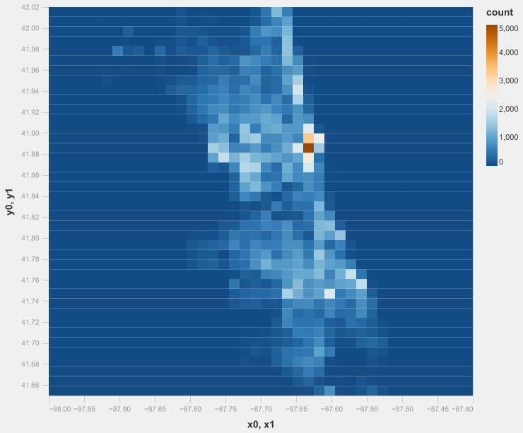

# Taking a closer look at the crimes in the beautiful Chicago
Alejandro Armas

## What is your current goal? Has it changed since the proposal?
My current goal is to try to understand better what kind of crimes are happening and when they are happening. As well
as if there is some way to help people.

## Are there data challenges you are facing? Are you currently depending on mock data?
So far the data has in this year has been very useful it might look hard to find more specific data about gang related crimes and the location of these places. It would potentially good to discern gang and non gang crimes comitted but it is going to be hard to get that info.

## Describe each of the provided images with 2-3 sentences to give the context and how it relates to your goal.

This bar chart shows the less common types of crimes in Chicago. Separating the data between the less commons and most common crimes highlights that even with these less common crimes, there are several differences in the amount between them. For example, it allow to visualize the number of sex offense and criminal sexual assaults 

This visualization presents the most common crime types in Chicago. Theft, battery, criminal damage and assault dominate, illustrating the city’s main public safety issues.

3. 
This heatmap explores crime frequency by hour of the day. It shows crimes tend to peak during the night specially 12:00 am regardless of the day

4. 
This line chart displays monthly crime trends throughout the year. Crimes increase during warmer months, suggesting seasonal patterns in criminal activity.

5. 
This heatmap examines hourly patterns among less common crimes. These allow us to get more into detail if depending in the crime commited, there is a different timing

6. 
This visualization shows hourly patterns for the most common crimes. These allow us to get more into detail if depending in the crime commited, there is a different timing. For example, theft  unlike other crimes is much more likely in the afternoon
7. 
This chart compares domestic versus non-domestic crimes. Most crimes are non-domestic, but domestic cases still represent a significant concern.

8. 
This chart identifies the most frequent crime locations, such as streets, residences, and businesses. It highlights public areas with high vulnerability.

9. 
This chart visualizes arrest rates by showing which crimes ended in an arrest. A large share of cases remain wihtonot arrested, pointing to challenges in enforcement.

10. 
This geographic heatmap visualizes the spatial distribution of crimes across Chicago. Darker zones indicate high-crime hotspots, useful for targeted interventions. Im a followup its going to be done considering the different boroughs. However now we can see that most crimes occur in downtown

## What form do you envision your final narrative taking? (e.g. An article incorporating the images? A poster? An infographic?)

A envision that the final narrative looks like an infograpghic